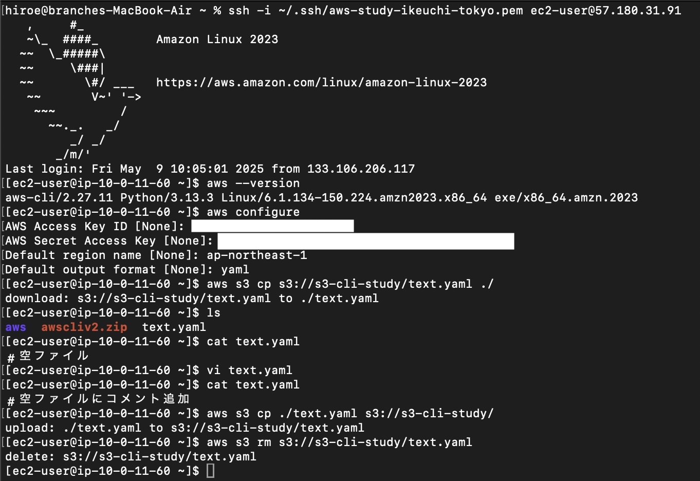

# 「30_S3の機能と活用方法」の課題提出

いつもお世話になっております。

新カリキュラム「30_S3の機能と活用方法」の課題提出となります。

## 提出内容

- **課題**：S3バケットの作成と動作確認。

---

## 提出ファイル

- markdownファイル（提出課題まとめ）
- JPG画像（操作手順の画面スクショ）

---

## 操作例（CLIでのS3操作）

下記は、AWS CLIを利用してS3バケットへのファイルダウンロード、アップロード、削除を行った際のターミナル画面です。

__先に注意事項として動画内で案内のあった、コンソール上でS3のバケット作成とアクセスキー作成__

### 1. CLIのインストール

```
curl "https://awscli.amazonaws.com/awscli-exe-linux-x86_64.zip" -o "awscliv2.zip"
unzip awscliv2.zip
sudo ./aws/install
```

### 2. CLIの動作確認

```
aws --version
```

### 3. 認証情報の設定

```
aws configure
```

### 4. EC2にS3よりファイルダウンロード

```
aws s3 cp s3://s3-cli-study/text.yaml
```

### 5. EC2からS3にファイルをアップロード

```
aws s3 cp ./text.yaml s3://s3-cli-study/
```

### 6. CLIでS3のバケットのテキストファイルを削除

```
aws s3 rm s3://s3-cli-study/text.yaml
```

### エビデンス
ターミナルの操作履歴は以下を参照



---

## 備考

- yamlファイルで内容のコメントを`vi text.yaml`で編集し、`cat text.yaml`で確認しています。コメント内容は下記となります。

| 編集前                    | 編集後                          |
|--------------------------|------------------------------------|
| 空ファイル                | 空ファイルにコメント追加         |

---

-  markdown記法での提出課題のまとめ方に関してアドバイスいただけると幸いです。
-  過剰にタイトルや表など使いすぎかもしれません。。。
