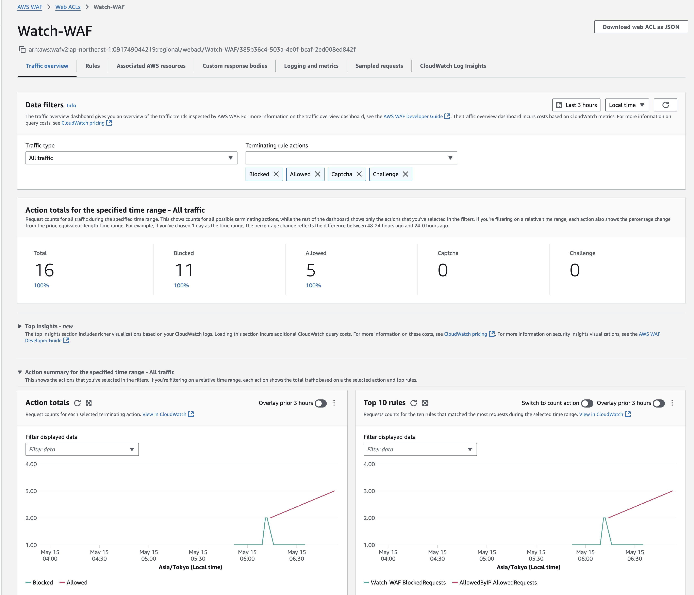
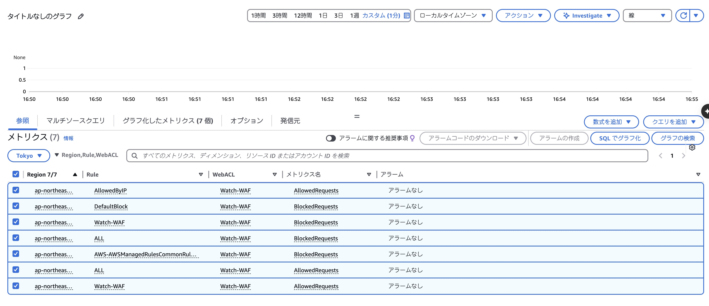

いつもお世話になっております。
新カリキュラム「31_CloudFormationを使った運用監視の環境構築」に対応した課題の質問となります。

### 課題内容
- CloudFormationでCloudWatchやログ環境を構築。
- 自作ルールを設定しアラーム設定を行う

### 質問内容
- 特定IP以外からのアクセスがあっても自動でアラームメールが送信されません。
- 手動テストでは通知が届きますが、自動では通知しない状態となっております。
- WAF-CloudWatchメトリクス連携の不具合が考えられますが原因が特定できずに数日経過してしまい、現状でレビューして頂き改善のヒントにさせて頂ければと思います！

**CloudFormationで以下の環境を構築しております。**
- WAFによる特定IP許可/他拒否設定
- CloudWatchアラーム（2分間で2回のブロック検知時にメール通知）
- SNSトピックによるメール配信

### 現状のコードや問題箇所の状態

主な問題箇所

 WAFにBLOCK記録あり(何度も挑戦したので、時間帯は違いますが、同じ状況です。)

 

 CloudWatchメトリクスに値が反映されない
 .jpg)

 メトリクスの状態
 

### 試してみたこと・調べた内容
- IAM権限追加（CloudWatchやWAFへのアクセス権限）
- 手動アラームテスト（通知成功）

本プルリクエストでは、上記課題の成果を
mdファイルおよびJPG画像形式で追加しております。

ご確認のほど、よろしくお願いいたします！
