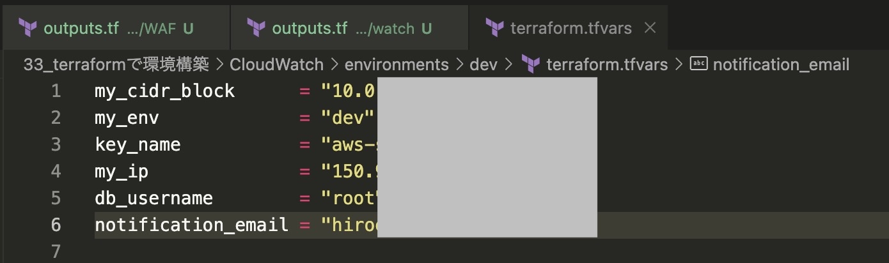
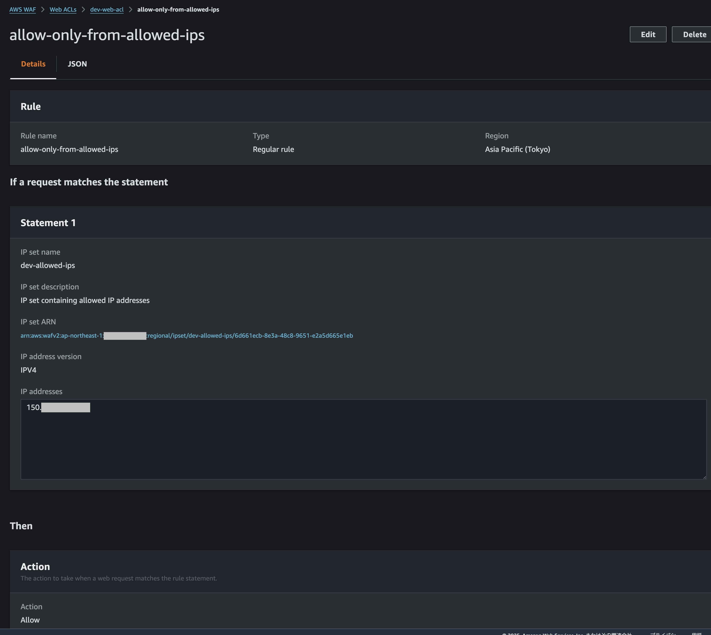
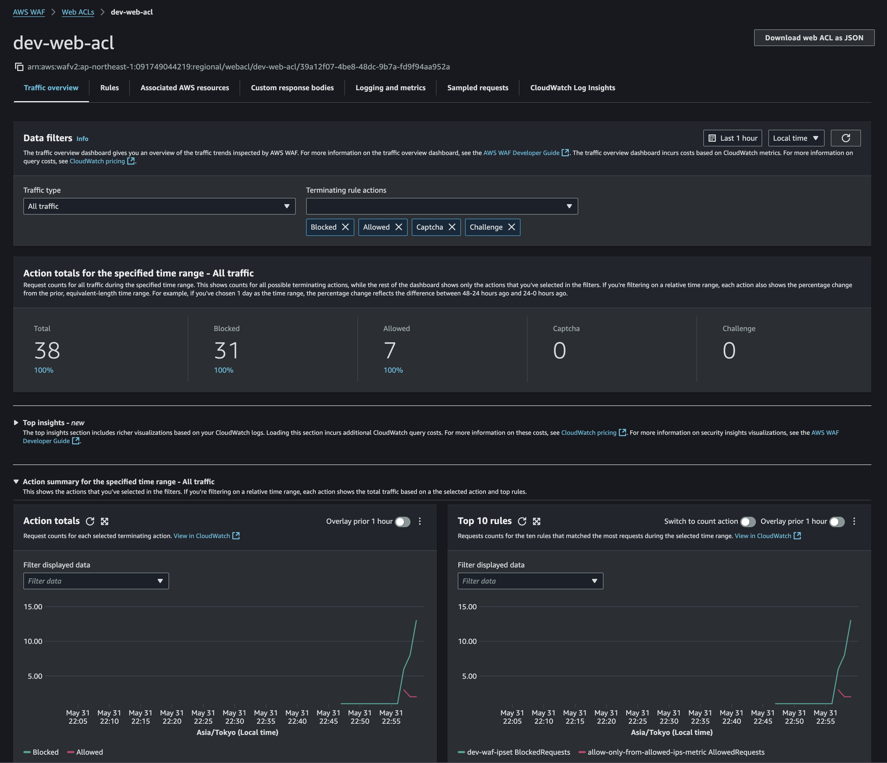
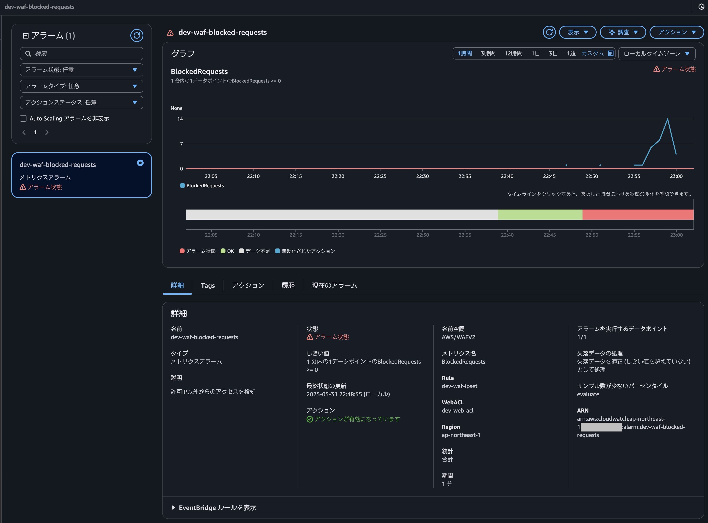
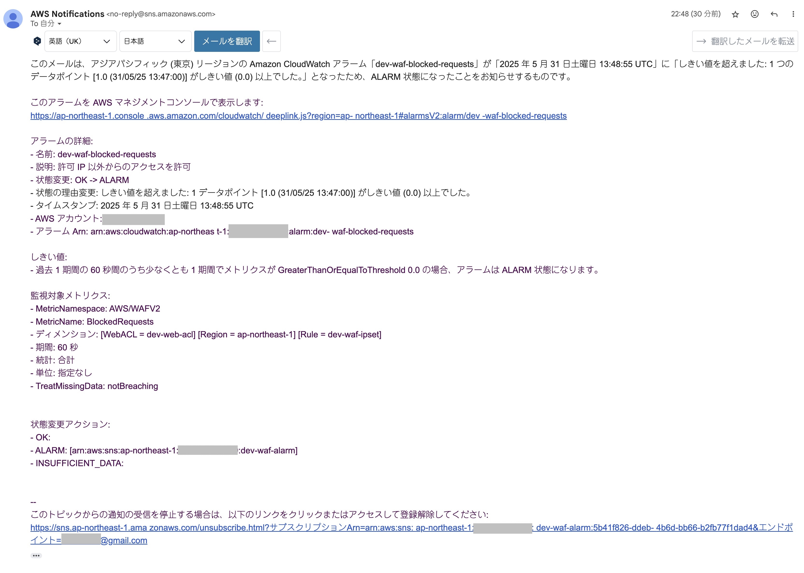
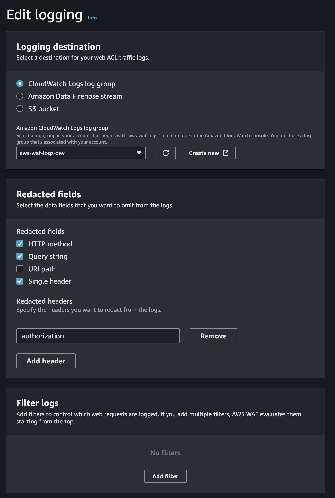
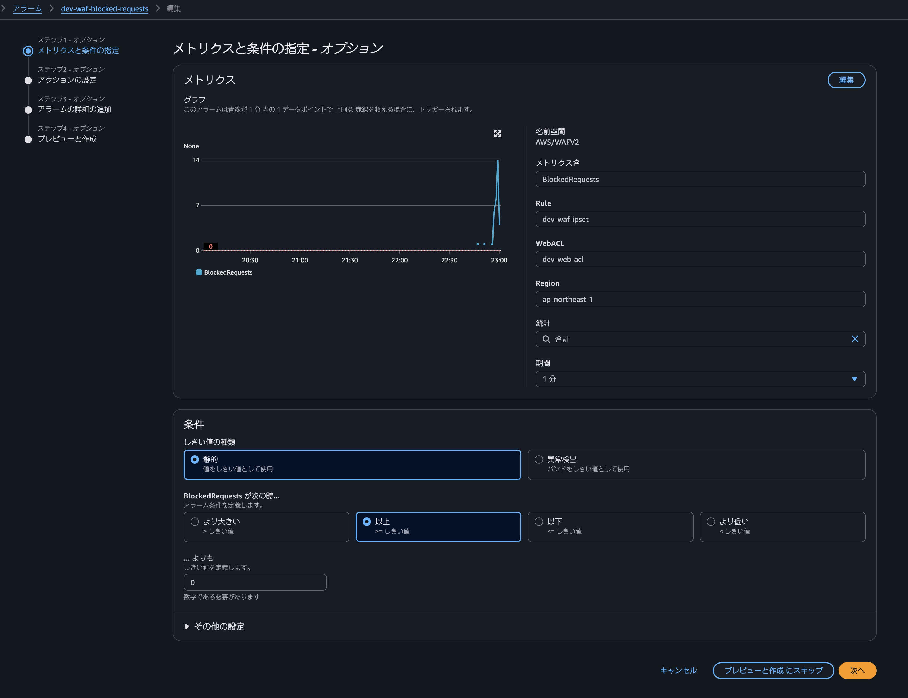

# terraform課題提出
いつもお世話になっております。

新カリキュラム「33_Terraformを使ったインフラのコード化と自動化」の課題提出となります。
前回までのvpc, subnet, ec2, security までに加えて
RDS, ALB, WAF, CloudWatch まで構築を行いました。

---

## 課題内容
- Terraformを使って今まで作った環境を構築（RDS, ALB, WAF CloudWatchを追加）
- アラームの設定を独自ルールとし、アラームを受け取る

---

## 提出内容
- モジュール説明
- **tfvarsファイルはセキュリティ上git管理せず、内容をスクリーンショット（jpg）で提出しています**
- 構築エビデンス（apply画面,アラーム受取画面）
 
 ルール設定（独自ルールアラームの条件を自身のIPアドレスのみを接続許可し、それ以外を拒否の設定をしメールにてアラームを受け取る）

---

<!-- BEGIN_TF_DOCS -->
## Requirements

| Name | Version |
|------|---------|
|  [aws](#requirement\_aws) | ~> 5.98.0 |

## Providers

No providers.

## Modules

| Name | Source | Version |
|------|--------|---------|
|  [alb](#module\_alb) | ../../modules/alb | n/a |
|  [ec2](#module\_ec2) | ../../modules/ec2 | n/a |
|  [main\_vpc](#module\_main\_vpc) | ../../modules/vpc | n/a |
|  [rds](#module\_rds) | ../../modules/rds | n/a |
|  [security](#module\_security) | ../../modules/security | n/a |
|  [subnet](#module\_subnet) | ../../modules/subnet | n/a |
|  [waf](#module\_waf) | ../../modules/WAF | n/a |
|  [watch](#module\_watch) | ../../modules/watch | n/a |

## Resources

No resources.

## Inputs

| Name | Description | Type | Default | Required |
|------|-------------|------|---------|:--------:|
|  [db\_username](#input\_db\_username) | DB用ユーザーネーム | `string` | n/a | yes |
|  [key\_name](#input\_key\_name) | EC2インスタンスで使用するSSHキーペア名 | `string` | n/a | yes |
|  [my\_cidr\_block](#input\_my\_cidr\_block) | VPCのCIDRブロック | `string` | n/a | yes |
|  [my\_env](#input\_my\_env) | 環境名(dev, staging, prodなど) | `string` | n/a | yes |
|  [my\_ip](#input\_my\_ip) | 自分のグローバルIPアドレス | `string` | n/a | yes |
|  [notification\_email](#input\_notification\_email) | 通知用のメールアドレス | `string` | n/a | yes |

## Outputs

No outputs.
<!-- END_TF_DOCS -->
---

## エビデンス

tfvarsファイル

自身のIP許可設定

WebACL画面

グラフ（アラーム）

メール内容

ログ設定

条件設定

---

ご確認のほど、よろしくお願いいたします。
