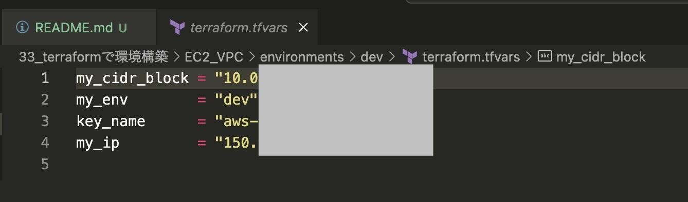
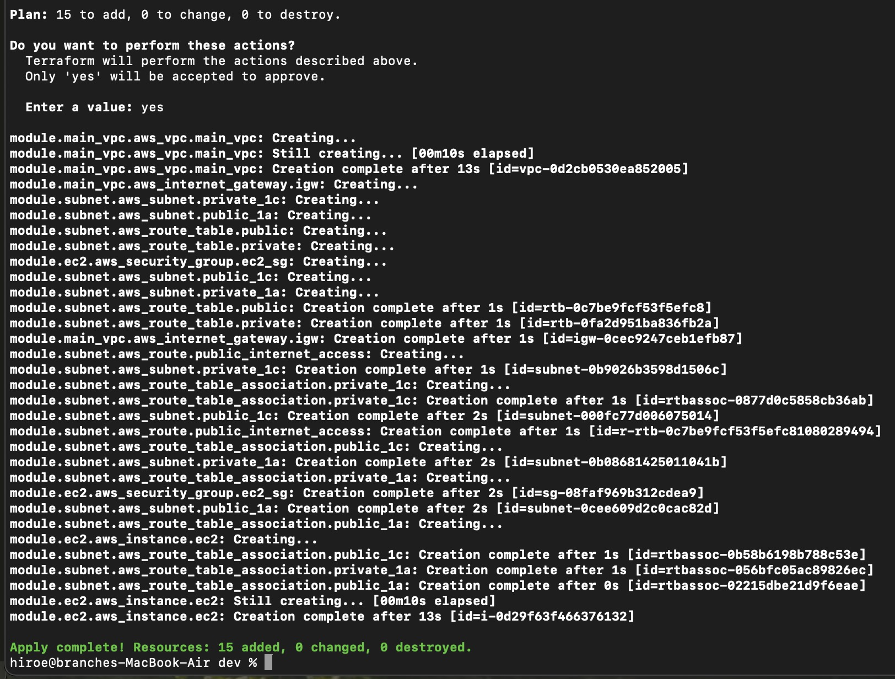
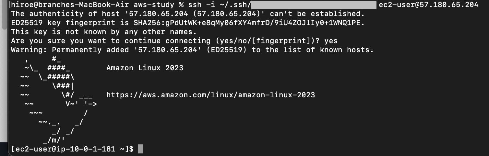
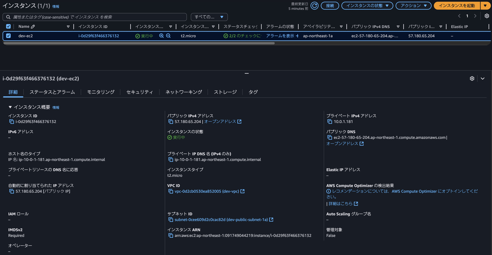
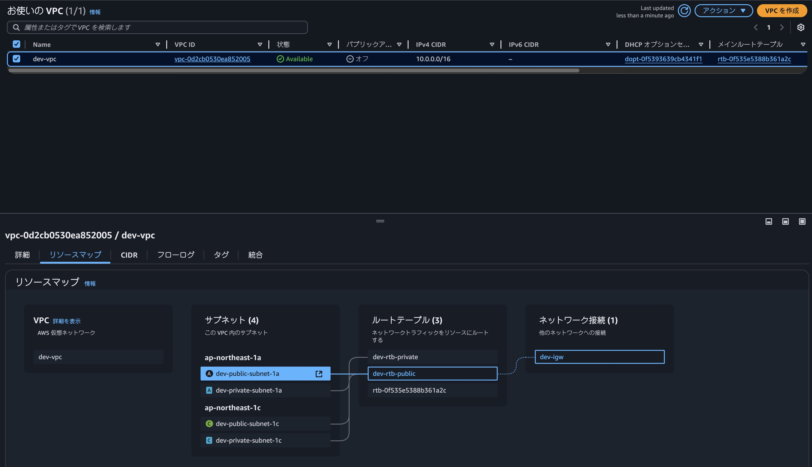

# terraform課題提出
いつもお世話になっております。

新カリキュラム「33_Terraformを使ったインフラのコード化と自動化」の課題提出となります。
現時点ではvpc, subnet, ec2まで構築済みです。途中段階でのレビューをお願いいたします。

---

## 課題内容
- Terraformを使って今まで作った環境を構築（vpc,subnet,ec2）

---

## 提出内容
- 下記ディレクトリ構成のtfファイル一式
- **tfvarsファイルはセキュリティ上git管理せず、内容をスクリーンショット（jpg）で提出しています**
- 構築エビデンス（apply画面、AWSコンソール画面等のスクリーンショット）

---

## ディレクトリ構成

```

├── environments/
│   └── dev/ # vpc,subnet,ec2の構成ファイル
│       ├── main.tf
│       ├── variables.tf
│       ├── provider.tf
│       ├── backend.tf   
│       └── terraform.tfvars 
│       
└── modules/
    ├── vpc/
    │   ├── main.tf
    │   ├── variables.tf
    │   └── outputs.tf
    ├── subnet/
    │   ├── main.tf
    │   ├── variables.tf
    │   └── outputs.tf
    ├── ec2/
    │   ├── main.tf
    │   ├── variables.tf
    │   └── outputs.tf

```

---

## tfvarsファイル



---

## エビデンス

apply画面（ターミナル）



SSH接続



instance画面



VPC画面



---

ご確認のほど、よろしくお願いいたします。
