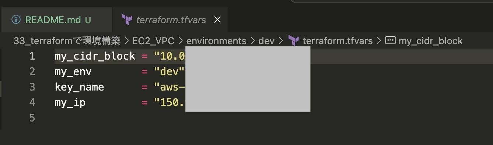
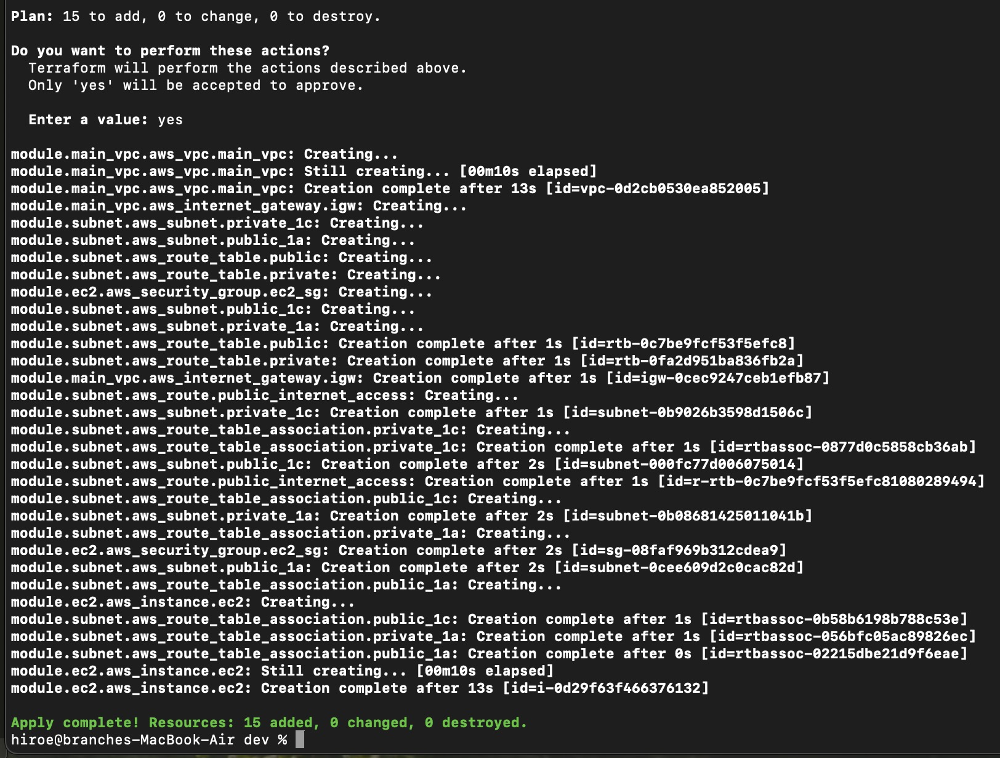

# terraform課題提出
いつもお世話になっております。

新カリキュラム「33_Terraformを使ったインフラのコード化と自動化」の課題提出となります。
前回までのvpc, subnet, ec2, security までに加えて
現時点ではRDS, ALB, まで構築済みです。

---

## 課題内容
- Terraformを使って今まで作った環境を構築（RDS, ALBを追加）

---

## 提出内容
- モジュール説明
- **tfvarsファイルはセキュリティ上git管理せず、内容をスクリーンショット（jpg）で提出しています**
- 構築エビデンス（apply画面）

---

<!-- BEGIN_TF_DOCS -->
## Requirements

| Name | Version |
|------|---------|
|  [aws](#requirement\_aws) | ~> 5.0 |

## Providers

No providers.

## Modules

| Name | Source | Version |
|------|--------|---------|
|  [alb](#module\_alb) | ../../modules/alb | n/a |
|  [ec2](#module\_ec2) | ../../modules/ec2 | n/a |
|  [main\_vpc](#module\_main\_vpc) | ../../modules/vpc | n/a |
|  [rds](#module\_rds) | ../../modules/rds | n/a |
|  [security](#module\_security) | ../../modules/security | n/a |
|  [subnet](#module\_subnet) | ../../modules/subnet | n/a |
|  [watch](#module\_watch) | ../../modules/watch | n/a |

## Resources

No resources.

## Inputs

| Name | Description | Type | Default | Required |
|------|-------------|------|---------|:--------:|
|  [db\_username](#input\_db\_username) | 自分のグローバルIPアドレス | `string` | n/a | yes |
|  [key\_name](#input\_key\_name) | EC2インスタンスで使用するSSHキーペア名 | `string` | n/a | yes |
|  [my\_cidr\_block](#input\_my\_cidr\_block) | VPCのCIDRブロック | `string` | n/a | yes |
|  [my\_env](#input\_my\_env) | 環境名(dev, staging, prodなど) | `string` | n/a | yes |
|  [my\_ip](#input\_my\_ip) | 自分のグローバルIPアドレス | `string` | n/a | yes |

## Outputs

No outputs.
<!-- END_TF_DOCS -->
---

## エビデンス

tfvarsファイル

apply画面（ターミナル）

---

ご確認のほど、よろしくお願いいたします。
