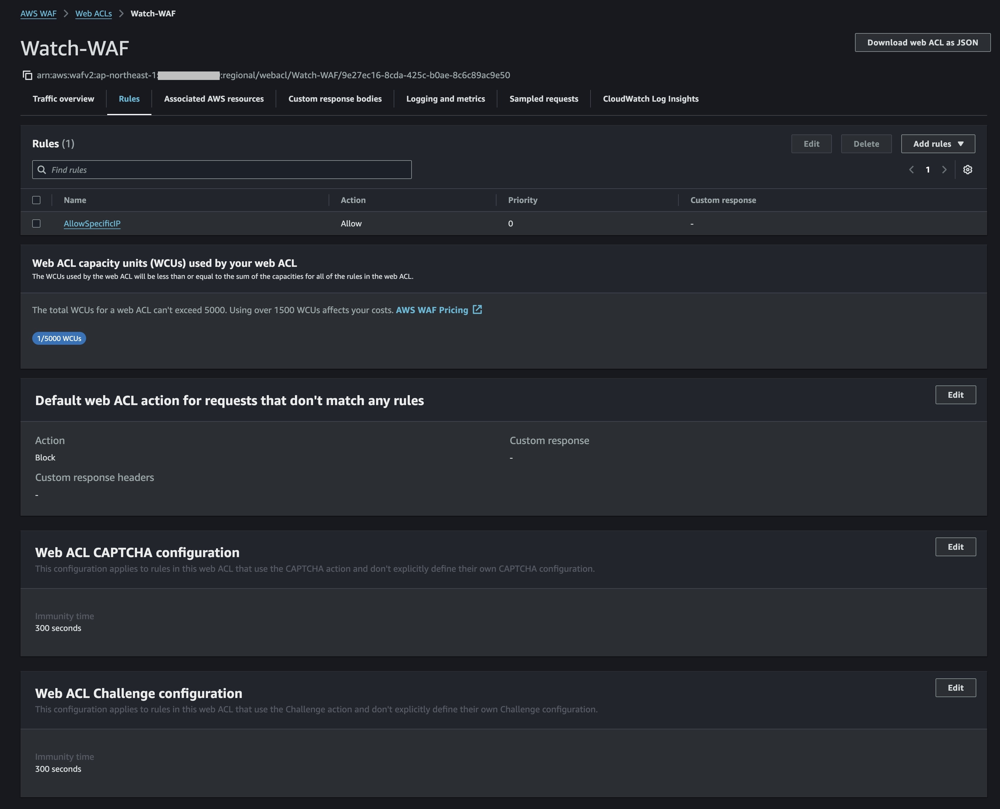
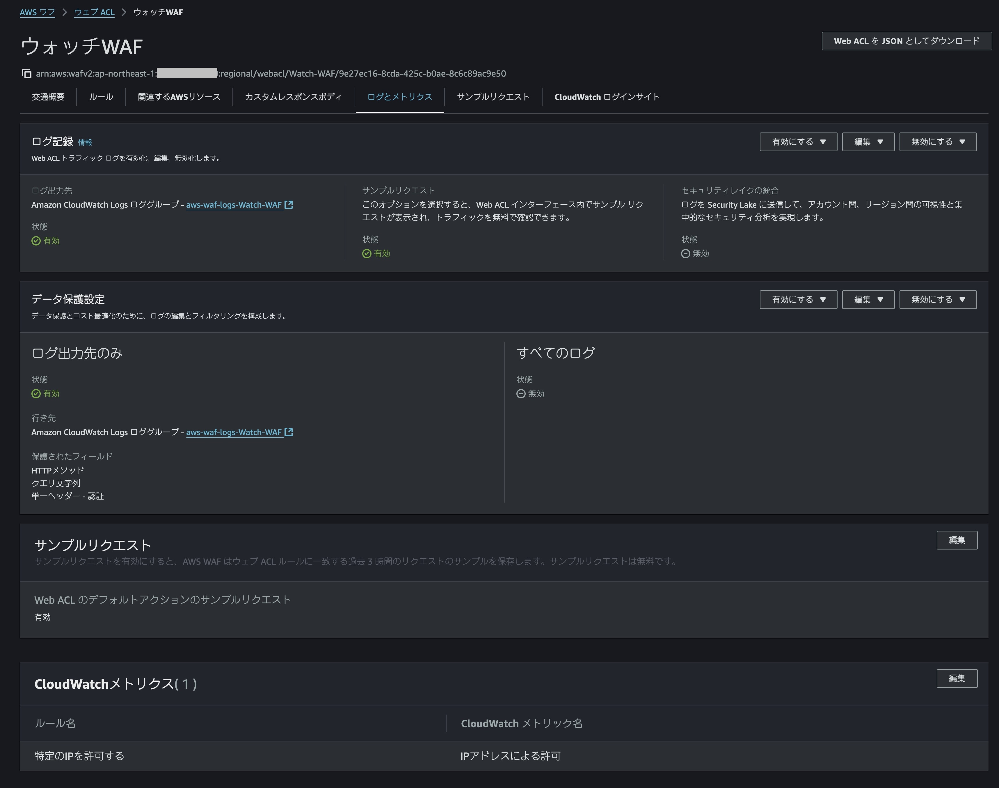
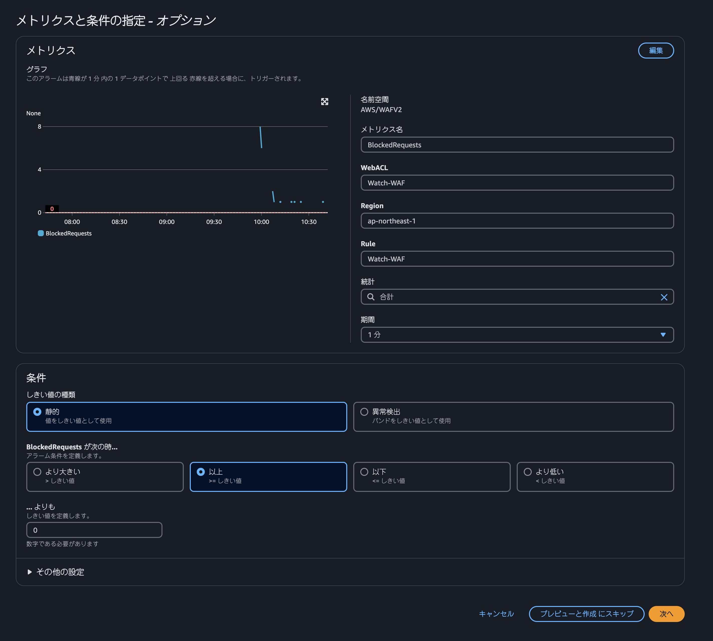
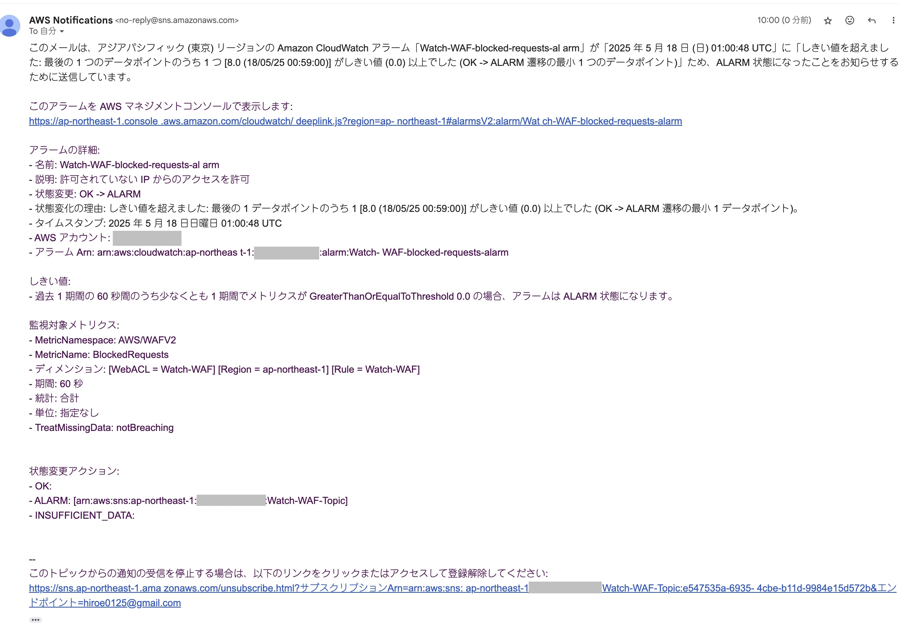

# 提出内容について

いつもお世話になっております。

新カリキュラム「31_CloudFormationを使った運用監視の環境構築」の課題提出となります。
本プルリクエストでは、上記課題の成果を
md,yamlファイルおよびJPG画像形式で追加しております。

ご確認のほど、よろしくお願いいたします！

## 課題内容

- WAFのWEBACLにて独自ルールを設定。
- WEBACLのトラフィックをCloudWatchLogsと連携
- WEBACLのトラフィックを利用したCloudWatch alarmを設定しメールを受け取る
- 上記設定をCloudFormationで行う

## 提出ファイル

- markdownファイル（提出内容まとめ）
- JPG画像（AWSコンソール画面スクショ）
- yamlファイル(課題を設定したcloudFormation用ファイル)

## エビデンス

ルールの設定内容

WAFとlogの連携の設定内容

アラームの設定内容

アラームのメール受取画面

